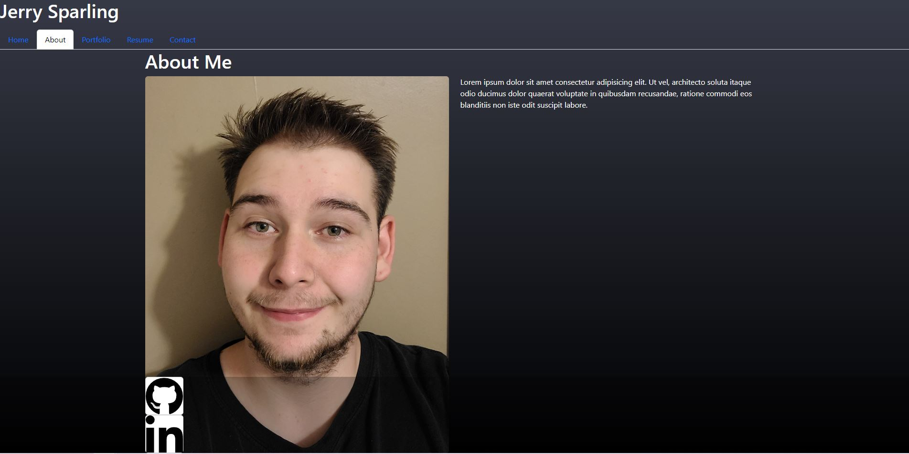

# React-Portfolio

## Table of Contents

[Description](#description)
 
[Usage](#usage)
 
[License](#license)
 
[Questions](#questions)
 

## Description

This is my react portfolio.

## Usage

Simply visit the site [Here](https://jerry-sparling-react-portfolio.netlify.app/).

## License
    This project is covered under the MIT license.
[Link](https://opensource.org/licenses/MIT)

## Questions
My [GitHub](https://github.com/Jrsparling) profile

Got questions? Reach out to me via email: [Jsparlingzi3757@gmail.com](mailto:Jsparlingzi3757@gmail.com)